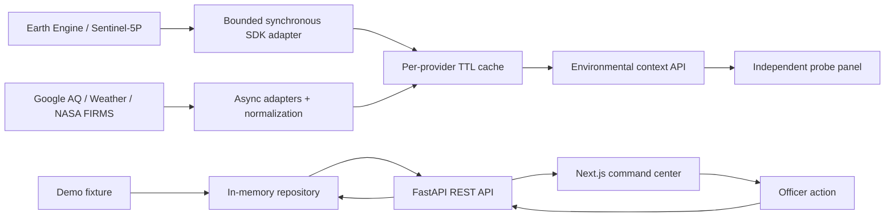
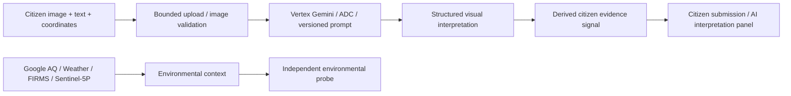
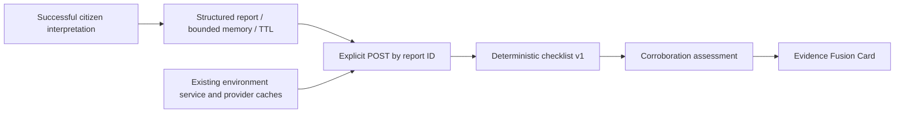
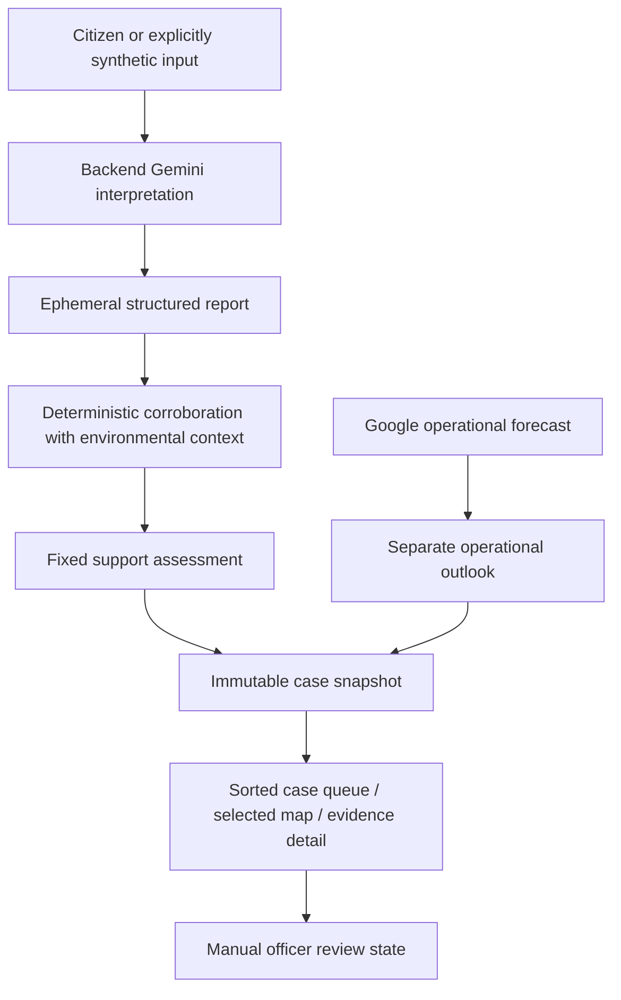
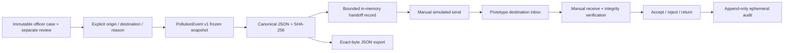

# AirshedOS architecture

## Current: Phase 3B

FastAPI is the source of API truth. `models.py` defines Pydantic domain models. `openapi.json` is exported from the application, and `api-schema.d.ts` is generated from it. The browser API client imports the generated types. Generated typing is a compile-time contract; it does not validate arbitrary responses at runtime. FastAPI validates its outgoing domain responses.

The app factory creates a fresh repository for each application instance. Routes use dependency injection to access it. The repository contains a single fictional scenario and serializes mutations with a lock; deep copies prevent callers from mutating stored objects accidentally. It is a small concrete boundary rather than a speculative service/plugin framework. Persistence can replace it when a later phase actually needs storage.

The repository provides list, detail, acknowledgment, and share operations. Acknowledgment is idempotent. Simulated sharing is idempotent per incident/target pair. Each successful mutation appends a structured action and updates the incident timestamp. Acknowledgment means an officer has seen the incident; it is not field verification, confirmation of a source, or resolution. No actions invoke third parties.

`OfficerCommandCenter` owns selected-workflow presentation. `SpatialMap` renders only a report/demo/probe and returned FIRMS detections through Google Maps JavaScript Advanced Markers. The SDK is loaded once; marker selection changes local detail state without source requests. A dedicated browser-restricted key is the only Maps credential exposed to the frontend. Text alternatives and review remain available after map failure. See [COMMAND_CENTER.md](COMMAND_CENTER.md).

## Domain decisions

| Concept | Responsibility |
| --- | --- |
| `CitizenReport` | Timestamped report, coordinates, description, language, optional image reference, source type |
| `EvidenceSignal` | Evidence category, source identity, availability/support status, optional confidence and observation time, provenance |
| `PollutionIncident` | Probabilistic event hypothesis, severity, workflow status, coordinates, jurisdiction, evidence, reports, forecast, recommended action, action history |
| `ForecastRisk` | Horizon, risk level, probability, possible direction, generation time, provenance |
| `Jurisdiction` | Stable ID, name, state, authority type |
| `IncidentAction` | Stable ID, action type, completion/simulation status, timestamp, optional sharing target |
| `Provenance` | Source ID, method, demo flag, and explanatory note |

Probabilities are finite values between 0 and 1. Coordinates are range checked. Timestamps are timezone-aware; `updated_at` cannot precede detection. Unavailable evidence has neither a confidence score nor an invented observation time in the fixture. Other evidence requires an observation time. Unsupported API fields are rejected.

The suggested model was extended with structured provenance on the incident and forecast, `is_demo`, `field_verification_required`, report references, and action IDs/history. This makes uncertainty and audit context explicit. Unavailable evidence may have `observed_at=null`, because there is no observation to timestamp. `model_version=null` correctly represents that no model ran.

## Scope and deployment

Two local processes or two Docker containers; no database, queue, application authentication, shared language packages or notification delivery. Environmental and Gemini cloud APIs are called only from the backend. Google Maps JavaScript runs in the browser using a separately restricted browser credential. CORS allows configured local frontend origins. The frontend calls the API from the browser, so its API URL must be reachable from that browser. Production Docker output uses Next.js standalone mode and a single Uvicorn worker. Compose waits for API readiness before starting the frontend.

In-memory state is deliberately ephemeral and unsuitable for multi-worker or public production use. Future durability and authorization need an explicit later-phase decision. The current API serves complete incident objects in the list because the fixture is tiny; a separate summary schema can be introduced when payload size warrants it.

The page provides loading, unavailable, empty, success, and failed-action states. It sorts incidents by severity then confidence, exposes a selected incident, and keeps actions disabled while requests are in flight. Refresh retrieves fresh state. Incident and ground times use IST; satellite times are explicitly labelled UTC.

## Environmental data boundary

`app/environment/models.py` extends the existing strict Pydantic conventions: finite coordinates and measurements, timezone-aware timestamps, explicit nullable fields, and provenance. `EnvironmentalContext` holds `AirQualityObservation`, `MeteorologicalObservation`, `FireObservation`, `EnvironmentalSourceStatuses`, and query metadata. Supporting `Measurement`, `PollutantMeasurement`, and `AirQualityIndex` retain source units and index identities. Environmental provenance cannot be marked demo.

`AirQualityProvider`, `WeatherProvider`, and `FireProvider` are small async protocols. Concrete Google and NASA adapters translate provider payloads, while `EnvironmentService` gathers independent results and returns partial success. FastAPI lifespan owns a shared HTTPX client; the test factory accepts an injected service. The incident repository and its behavior are unchanged.

Each outbound attempt has a total/read timeout (default 8 seconds, connect 3 seconds), two attempts maximum, a 0.2 second retry delay, and a 2 MB body limit. Only transport errors, rate limits, and selected transient 5xx responses retry. A provider deadline of `2 × timeout + 1` seconds also bounds time waiting for its lock. Errors become safe source messages. Structured logs contain provider, success, status, and latency; neither raw bodies nor credential-bearing URLs are logged.

The process-local LRU cache has at most 256 entries shared across providers. Google results default to 600 seconds; FIRMS to 900 seconds. Keys preserve exact validated coordinates and FIRMS radius/product. Ground-provider queries retain exact coordinates; satellite uses its documented rounded neighborhood separately. Three provider locks coalesce identical concurrent requests and limit outbound quota pressure. Timers purge expired entries even if the point is never queried again; lookups also enforce expiry. Only successful observations (including empty FIRMS lists) are cached, and copied responses retain their original observation/retrieval times with a `cached` status. Nothing is persisted. Ground-provider TTL configuration is capped at one hour; zero disables caching.

`GET /api/v1/environment/context` validates latitude/longitude and accepts optional timezone-aware `at`. For ground providers, `at` is recorded as `requested_reference_time`, not silently used as a historical query; `requested_at` is the actual request time. `GET /api/v1/environment/sources` reports configuration only, not credential validity or provider health. Missing optional credentials are normal. Invalid user parameters return 422; upstream failures still return a valid context with independent source states.

`EnvironmentPanel` calls only the backend. It shows source-specific units, statuses, times and provenance separately from the fictional incident. There is no path from live readings to demo evidence, confidence, or forecast. Fire `null` means no valid response; `[]` means a successful zero-detection query. `FIRMS_DATASET` selects one supported VIIRS product, default NOAA-20, with NOAA-21 and legacy S-NPP options. The API carries `fire_dataset` and the UI displays it even for zero detections. The browser imports generated OpenAPI types, not a second handwritten schema.

## Creative direction

The user-supplied Stitch ZIP contains multiple landing-page directions. The dark atmospheric learning-page reference informed charcoal-green surfaces, pale green controls, restrained borders and serif section headings. These were adapted into an operational workspace with a coordinate probe and compact data cards. No reference assets, external fonts, decorative hero, or marketing flows were added. Desktop uses three source columns; smaller screens stack them. Statuses are written in text as well as color, controls have visible focus, and reduced motion is respected.

This intentionally refines the Phase 1A appearance under the user's direct request while preserving its workflows, overriding the attached brief's narrower “Do NOT redesign” direction.

## Planned only

Translation, Vertex AI prediction, BigQuery, source attribution, persistence, application authentication, real authority integration and real notification delivery remain unimplemented. Phase 2E adds the separate provider outlook; Phase 3A adds the selected-workflow map and ephemeral officer review described below.

## Satellite evidence boundary

`SatelliteProvider` is a small protocol with one concrete `EarthEngineSentinel5PProvider`. The official Python SDK authenticates with backend ADC and an explicit project on first use. Credentials and raw EE objects never enter API models. The fixed product set is NO₂, CO and UV Aerosol Index; this is not a generic remote-sensing framework.

`SatelliteAtmosphericContext` includes original and rounded query coordinates, geometry radius, actual request/generation times, explicit start/end/lookback, product results, aggregate availability and provenance. Each `SatelliteObservation` keeps acquisition time, retrieval time, age, collection/band/image identity, upstream product ID, native units, source footprint metadata where supplied, grid scale, reducer and product-specific QA. `SatelliteProductResult` separates provider status from scientific availability (`no_scene`, `quality_filtered`, `no_usable_pixels`) and operational failures. No fabricated confidence percentages or values are generated.

The full environmental endpoint gathers the satellite task alongside the original three providers. `include_satellite=false` skips it completely; the UI uses that option and the dedicated satellite endpoint concurrently. The original three-key `source_statuses` contract is preserved. Satellite lives in the additive nullable `satellite` field. Dedicated and full endpoints share all satellite service/cache logic.

The SDK is synchronous: one thread-backed batch is allowed per provider instance. A 25-second batch deadline and 10-second SDK/socket timeout bound work; SDK compute retries are disabled. Products are queried sequentially within the batch, while ground providers run concurrently. A timeout retains completed products. Python cannot kill an in-flight RPC: the provider stays reserved until it exits and returns `busy` rather than launching additional work. Lock wait plus lookup has a 26-second service deadline by default. There are no queues, background workers, or persistent jobs.

Satellite reuses the existing 256-entry LRU with a separate lock. Keys include coordinates rounded to four decimals, exact window boundaries, radius and the fixed product set. The default window ends at the beginning of the current UTC hour (up to 59m59s intentionally excluded), making reuse deterministic within the hour. Explicit `at` retains its exact timezone-aware instant. TTL is 3,600 seconds (configurable 0–7,200); cached observations retain original retrieval/acquisition times and update age at response time. Genuine empty/QA-filtered searches are cached; a batch with any provider error is not cached. Absence never means zero pollution.

QA and native units follow [the dataset contract](DATA_SOURCES.md#earth-engine--sentinel-5p). Latest observations are selected independently and may have different timestamps within the stated window; they are not synchronized or fused. Degraded, missing and unknown scene metadata is conservatively excluded. Exact nominal quality spellings and product-specific processing modes follow the verified source semantics in DATA_SOURCES.md; raw metadata values are preserved. L3 missing coverage and upstream pixel masking cannot always be separated.

## Independent citizen interpretation boundary (Phase 2A)

The analyze operation still does not query or score environmental evidence. Phase 2B adds a separate explicit join after this operation, described below. The existing fictional incident and all its fixture-only evidence remain separate.

`app/citizen` contains a focused router, image validation, settings, service, models and one provider protocol. `CitizenEvidenceAnalyzer` allows a fake in tests and a `GeminiCitizenEvidenceAnalyzer` in runtime. The app factory injects the analyzer without initializing remote credentials at startup. The official `google-genai` client uses `vertexai=True`, backend ADC, project/location and a configurable model. There are no agents, tools, function calls, chat history, explicit prompt caches or storage APIs.

The provider uses `response_mime_type=application/json` and an enum-constrained `response_schema`, then strictly validates JSON with Pydantic. Vertex's supported `nullable` representation replaces JSON Schema's null union; `$ref` definitions are inlined. Remote array-length constraints caused an authenticated HTTP 400, so those bounds are enforced locally (1–8 items each), with the same enum choices and 2,048 output-token limit. Extra fields, free-text visual claims, malformed/truncated/blocked output, coerced booleans, unknown event types and inconsistent insufficient-evidence/confidence combinations are rejected. No prose parsing or silent repair is performed. Fixed server copy supplies the evidence summary and disclaimer.

`CitizenReport` remains the human submission (language `und`, no image URL). `GeminiEvidenceAnalysis` is a separate derived result with tentative event type, ordinal model-estimated confidence, tri-state visible features/context, scene/scale, controlled visual observations and uncertainties. Null means visually indeterminate; false means not visible, not confirmed absence. Confidence is not a measured probability, severity or incident confidence.

`CitizenVisualSignal` extends the existing `EvidenceSignal` with `source_report_id`, `derived=true`, interpretation time and model provenance. The only existing-domain enum addition is `EvidenceStatus.INTERPRETED`; it carries no incident confidence and permits unknown observation time. `observed_at=null` correctly avoids mistaking upload time for image acquisition. `ModelProvenance` extends `Provenance` with source report ID, model, returned model version (null if omitted), prompt version `citizen_evidence_v1`, generation time, `author=model` and the ordinal confidence basis. No citizen report or signal is inserted into the demo repository.

Upload processing is limited to 5 MiB of image bytes plus 64 KiB of multipart overhead. A scoped ASGI limiter counts actual streamed bytes before multipart parsing, independent of Content-Length. Pillow checks decoded format, still-image status and 16 MP dimensions before full decode. The image is oriented, metadata stripped, bounded to 2048×2048 and re-encoded as JPEG in memory. Multipart upload handles close before inference (FastAPI also closes them on validation failures); large temporary spool files are deleted. There is no application media storage. Phase 2B retains only temporary structured metadata after a successful interpretation. No image bytes, base64, full citizen description, raw model result or provider exception body is logged. The response preserves citizen text as human-authored context, rendered as escaped text in React; model output cannot insert HTML or arbitrary text.

A 30-second service deadline and SDK HTTP timeout bound inference; one attempt, no automatic retries. Cancellation exits the async client context. Invalid/schema/safety responses never retry. Safe result states distinguish not-configured, authentication/permission/API enablement, model unavailable, quota, timeout, safety block, invalid response and generic provider failure. Valid input with provider failure returns HTTP 200 and null analysis/evidence; invalid input returns 422 or 413. Logs include only request ID, configured model, prompt version, status, event class and latency. This local prototype has no public-service authentication or admission control; deployment beyond trusted local use requires a separately scoped access/quota decision.

The frontend uses generated OpenAPI types and browser-owned object URLs for preview, revoking them on replacement/clear/unmount. It never embeds Vertex credentials. Submission fields are disabled during inference; errors allow manual retry. Citizen description and AI interpretation have separate labels. Environmental provider cards use their existing independent request paths. CI blocks network transports, uses injected fakes and synthetic browser responses, and never invokes the live evaluation script.

## Transparent corroboration boundary (Phase 2B)

`app/corroboration` contains strict domain models, validated configuration, a bounded ephemeral repository, deterministic rules/aggregation and one POST route. The existing citizen router stores only successful structured outputs; Gemini inference and response/error behavior are preserved. The additive response TTL tells the UI the maximum temporary availability.

The repository accepts only report metadata, model analysis and derived signal/provenance. It has 256 entries and a 30-minute TTL by default, deep-copy isolation, fixed expiry timers, LRU eviction and shutdown cleanup. Operations occur synchronously between awaits on the single application event loop. No image argument, image URL, durable store, assessment cache or user-controlled replacement analysis exists. A retained request-local copy may finish an accepted lookup after TTL expiry; idle repository entries still expire. This does not create multi-worker consistency or access control.

The POST route rejects non-empty bodies and missing/invalid/expired IDs before network work. It supplies stored coordinates and the report creation time to the existing environment service. That service independently bounds and gathers provider requests. Ground queries remain current, satellite uses the exact submission-ended window, and caches retain original observation/retrieval times. Partial failures yield a complete assessment with visible degraded rules. No call to Gemini is made during corroboration.

The pure engine uses explicit normalized context time; each rule returns its inputs, rationale, source references, ages, offsets and provenance. Assessment IDs derive deterministically from output and policy. [Rules and aggregation](CORROBORATION_RULES.md) are versioned, conservative and contain no hidden probabilities. Satellite observations are context-only. Weather alignment is conditional on a nearby recent fire, not an independent pollution stream. Actual visual-field disagreement is a review guard; missing data never supplies a contradiction.

The generated OpenAPI contract owns frontend types. The keyed CorroborationCard issues a body-free POST on explicit click, shows lookup/checklist loading, handles missing reports, and aborts pending UI work on clear/replacement. Its concise evidence rows and expandable rule/source details use the existing green editorial/status styling. Browser tests use synthetic responses. The fictional incident repository is never read or mutated by corroboration.

## Offline data and model evaluation (Phases 2C–2D)

`prediction/` builds hash-verified OpenAQ/ERA5 historical artifacts independently of FastAPI. `prediction_model/` consumes the operational profile through separate offline CLIs. Its dependencies are pinned in `requirements-model.lock` and are installed in development/CI only, not in the product API Docker image. There are no model imports or prediction routes in `app/`.

The selection path is source/contract hash verification → filtered training/October snapshots → three purged training-only CV folds → twelve serious validation candidates → immutable go/no-go decision. October macro-station MAE is primary; preprocessing and station weights use fitting rows only. A distinct guarded evaluator can reserve one final test access only after a qualifying decision and matching artifact hashes. Research inputs are prohibited in the primary feature allowlist.

The actual Phase 2D outcome is **MODEL_NOT_ACCEPTED**. The pipeline stopped after all candidates failed October baseline gates. No candidate test evaluation, final model bundle, Vertex training job, online endpoint or forecast UI change followed. Read-only cloud preflight confirmed Vertex access but found no GCS bucket and a disabled Artifact Registry API; it created no resources. The runtime diagram and its existing demo forecast remain unchanged. See [PREDICTION_MODEL.md](PREDICTION_MODEL.md) for the conditional availability contract and [PHASE_2D_VERIFICATION.md](PHASE_2D_VERIFICATION.md) for negative results and deferred downstream gates.

## Google operational outlook (Phase 2E)

The `GoogleAirQualityForecastProvider` uses the existing backend key and HTTP transport. `AirQualityForecastContext` holds hourly valid times, native pollutant/index values, 6/12/24-hour summaries, current comparison, explicit source state and provenance. `GET /api/v1/environment/forecast` is independent of the existing context route. The current endpoint and its three ground-source status keys remain unchanged; satellite remains independently available.

Citizen → Gemini → structured citizen evidence → deterministic environmental corroboration → assessment → **Google AQ operational forecast / separate outlook** → officer decision support. The route attaches optional `forecast_outlook` only after `assess()` completes, reusing its current AQ result. The rules, contributing source IDs, support and recommended next step never consume the forecast. No independent vote is created for Google's second related output.

The existing cache stores one canonical 24-hour forecast batch for 900 seconds, keyed by coordinates, UTC window and API options. The forecast endpoint can serve all three horizons from that batch. Current AQ and forecast execute concurrently in the standalone endpoint; the UI fetches forecast separately so current cards can render first. Existing source/provider failure handling is retained; forecast failures return a typed absent outlook. No queue, database, new dependencies, model imports or frontend credentials were introduced.

`ForecastOutlook` is shared by the Evidence Fusion Card and standalone coordinate panel. It shows attributed provider results, coverage, a transparent peak/current category and native-unit/CPCB comparisons. Backend UTC is preserved; displayed times are labelled IST. Source provenance and exact thresholds are expandable. No charts, map overlays or product redesign. See [FORECASTING.md](FORECASTING.md) for the complete contract, restrictions and policy. Phase 2D's rejected research remains untouched.

## Officer review boundary (Phase 3A)

Forecast never feeds back into support. Corroboration registers a deep-copied snapshot with `OfficerCaseRepository`, bounded to 64 and capped by the source report's remaining TTL. Evidence and workflow metadata have separate models. Only review state, action time, revision and allowed transitions change. Routes reject arbitrary evidence writes and compare revisions atomically within the single event loop. Snapshots expire even without subsequent requests and are cleared at shutdown. No image bytes, database or identity is added.

Queue ordering groups NEW, UNDER_REVIEW, ACKNOWLEDGED/MONITORING, CLOSED_NO_ACTION, then descending submission time and case ID. Prototype jurisdiction uses explicitly non-authoritative interior lookup rectangles; outside/ambiguous points are Unknown. `CitizenReport.is_synthetic` defaults false and labels the provided demo input independently from provider statuses. OpenAPI remains the source for frontend types.

The developer snapshot recorder reads the existing local forecast/current AQ endpoints once per invocation and writes only ignored local prospective JSON. It does not train/evaluate a custom model, query historical forecasts or poll. Phase 2D's MODEL_NOT_ACCEPTED result and locked test set remain intact. Phase 3B adds the strictly simulated interoperability boundary below.

## Frozen interoperability boundary (Phase 3B)

`app/handoff` owns the strict contract, allowlisted packet builder, deterministic serializer, bounded repository and focused router. It depends on normalized domain models and a deep copy of an active officer case; it has no environmental service or Gemini dependency. No handoff route can mutate the source case. The lifecycle envelope and audit change independently of immutable event bytes; recomputed hash mismatch blocks state advancement and export. Source/destination are views over the same process-local record, not separate remote systems.

The store holds 128 packets for 3,600 seconds with oldest-created eviction and independent expiry, including when the source expires. It caps each audit at 128 entries. Revision checks occur atomically within one event loop; there is no distributed consistency or authenticated actor. Event versions increase process-wide and may have gaps per case. Generic control-room actor labels are workflow roles only.

OpenAPI owns frontend types. The existing command center adds a keyed handoff composer and destination panel; selection reuses the existing map with a frozen report marker and full text fallback. Provider readings/forecast/rules retain their original semantics, units and provenance. Receipt never refreshes them. The export downloader hashes exact bytes before download; this is integrity, not a signature. No raw media or citizen free text enters the packet.

[INTEROPERABILITY.md](INTEROPERABILITY.md) specifies field meanings, canonical bytes, routes, transitions, prototype boundaries, expiry and deferred production requirements. No real authority routing, external handoff network, database, accounts or Phase 3C work is added. Phase 2D MODEL_NOT_ACCEPTED and prior verification records remain intact.
