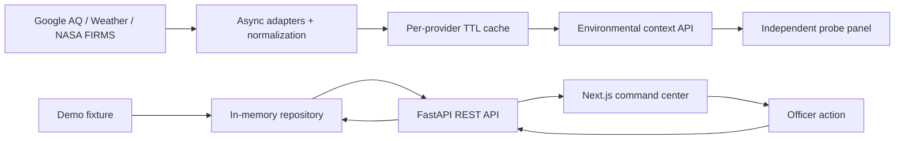

# AirshedOS architecture

## Current: Phase 1B

FastAPI is the source of API truth. `models.py` defines Pydantic domain models. `openapi.json` is exported from the application, and `api-schema.d.ts` is generated from it. The browser API client imports the generated types. Generated typing is a compile-time contract; it does not validate arbitrary responses at runtime. FastAPI validates its outgoing domain responses.

The app factory creates a fresh repository for each application instance. Routes use dependency injection to access it. The repository contains a single fictional scenario and serializes mutations with a lock; deep copies prevent callers from mutating stored objects accidentally. It is a small concrete boundary rather than a speculative service/plugin framework. Persistence can replace it when a later phase actually needs storage.

The repository provides list, detail, acknowledgment, and share operations. Acknowledgment is idempotent. Simulated sharing is idempotent per incident/target pair. Each successful mutation appends a structured action and updates the incident timestamp. Acknowledgment means an officer has seen the incident; it is not field verification, confirmation of a source, or resolution. No actions invoke third parties.

`OperationsPane` receives a typed incident and renders a labelled SVG schematic. It is isolated from data fetching and actions so a later mapping implementation can replace it without rewriting command logic. Its generic geometry is not derived from a geospatial boundary dataset. No tile service, map key, imagery, or map SDK is used.

## Domain decisions

| Concept | Responsibility |
| --- | --- |
| `CitizenReport` | Timestamped report, coordinates, description, language, optional image reference, source type |
| `EvidenceSignal` | Evidence category, source identity, availability/support status, optional confidence and observation time, provenance |
| `PollutionIncident` | Probabilistic event hypothesis, severity, workflow status, coordinates, jurisdiction, evidence, reports, forecast, recommended action, action history |
| `ForecastRisk` | Horizon, risk level, probability, possible direction, generation time, provenance |
| `Jurisdiction` | Stable ID, name, state, authority type |
| `IncidentAction` | Stable ID, action type, completion/simulation status, timestamp, optional sharing target |
| `Provenance` | Source ID, method, demo flag, and explanatory note |

Probabilities are finite values between 0 and 1. Coordinates are range checked. Timestamps are timezone-aware; `updated_at` cannot precede detection. Unavailable evidence has neither a confidence score nor an invented observation time in the fixture. Other evidence requires an observation time. Unsupported API fields are rejected.

The suggested model was extended with structured provenance on the incident and forecast, `is_demo`, `field_verification_required`, report references, and action IDs/history. This makes uncertainty and audit context explicit. Unavailable evidence may have `observed_at=null`, because there is no observation to timestamp. `model_version=null` correctly represents that no model ran.

## Scope and deployment

Two local processes or two Docker containers; no database, queue, authentication, shared language packages, cloud resources, or notification delivery. CORS allows configured local frontend origins. The frontend calls the API from the browser, so its API URL must be reachable from that browser. Production Docker output uses Next.js standalone mode and a single Uvicorn worker. Compose waits for API readiness before starting the frontend.

In-memory state is deliberately ephemeral and unsuitable for multi-worker or public production use. Future durability and authorization need an explicit later-phase decision. The current API serves complete incident objects in the list because the fixture is tiny; a separate summary schema can be introduced when payload size warrants it.

The page provides loading, unavailable, empty, success, and failed-action states. It sorts incidents by severity then confidence, exposes a selected incident, and keeps actions disabled while requests are in flight. Refresh retrieves fresh state. Display times are explicitly in IST.

## Environmental data boundary

`app/environment/models.py` extends the existing strict Pydantic conventions: finite coordinates and measurements, timezone-aware timestamps, explicit nullable fields, and provenance. `EnvironmentalContext` holds `AirQualityObservation`, `MeteorologicalObservation`, `FireObservation`, `EnvironmentalSourceStatuses`, and query metadata. Supporting `Measurement`, `PollutantMeasurement`, and `AirQualityIndex` retain source units and index identities. Environmental provenance cannot be marked demo.

`AirQualityProvider`, `WeatherProvider`, and `FireProvider` are small async protocols. Concrete Google and NASA adapters translate provider payloads, while `EnvironmentService` gathers independent results and returns partial success. FastAPI lifespan owns a shared HTTPX client; the test factory accepts an injected service. The incident repository and its behavior are unchanged.

Each outbound attempt has a total/read timeout (default 8 seconds, connect 3 seconds), two attempts maximum, a 0.2 second retry delay, and a 2 MB body limit. Only transport errors, rate limits, and selected transient 5xx responses retry. A provider deadline of `2 × timeout + 1` seconds also bounds time waiting for its lock. Errors become safe source messages. Structured logs contain provider, success, status, and latency; neither raw bodies nor credential-bearing URLs are logged.

The process-local LRU cache has at most 256 entries shared across providers. Google results default to 600 seconds; FIRMS to 900 seconds. Keys preserve exact validated coordinates and FIRMS radius/product. There is no geographic rounding/reuse across distinct points. Three provider locks coalesce identical concurrent requests and limit outbound quota pressure. Timers purge expired entries even if the point is never queried again; lookups also enforce expiry. Only successful observations (including empty FIRMS lists) are cached, and copied responses retain their original observation/retrieval times with a `cached` status. Nothing is persisted. TTL configuration is capped at one hour; zero disables caching.

`GET /api/v1/environment/context` validates latitude/longitude and accepts optional timezone-aware `at`. `at` is recorded as `requested_reference_time`, not silently used as a historical query; `requested_at` is the actual request time. `GET /api/v1/environment/sources` reports configuration only, not credential validity or provider health. Missing optional credentials are normal. Invalid user parameters return 422; upstream failures still return a valid context with independent source states.

`EnvironmentPanel` calls only the backend. It shows source-specific units, statuses, times and provenance separately from the fictional incident. There is no path from live readings to demo evidence, confidence, or forecast. Fire `null` means no valid response; `[]` means a successful zero-detection query. `FIRMS_DATASET` selects one supported VIIRS product, default NOAA-20, with NOAA-21 and legacy S-NPP options. The API carries `fire_dataset` and the UI displays it even for zero detections. The browser imports generated OpenAPI types, not a second handwritten schema.

## Creative direction

The user-supplied Stitch ZIP contains multiple landing-page directions. The dark atmospheric learning-page reference informed charcoal-green surfaces, pale green controls, restrained borders and serif section headings. These were adapted into an operational workspace with a coordinate probe and compact data cards. No reference assets, external fonts, decorative hero, or marketing flows were added. Desktop uses three source columns; smaller screens stack them. Statuses are written in text as well as color, controls have visible focus, and reduced motion is respected.

This intentionally refines the Phase 1A appearance under the user's direct request while preserving its workflows, overriding the attached brief's narrower “Do NOT redesign” direction.

## Planned only

Earth Engine / Sentinel-5P, Gemini, citizen intake, translation, Vertex AI, BigQuery, prediction, live evidence scoring, Google Maps, persistence, authentication and real notification delivery are not implemented. Phase 1C should first establish a bounded satellite data-availability probe with explicit spatial resolution, time windows, provenance and partial-failure semantics; it must not imply causal attribution. No Phase 1C work was started.
