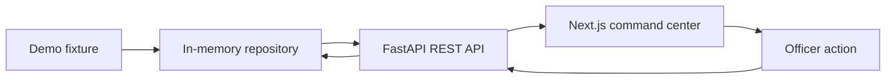
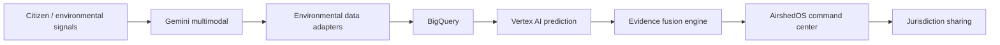

# AirshedOS architecture

## Current: Phase 1A

FastAPI is the source of API truth. `models.py` defines Pydantic domain models. `openapi.json` is exported from the application, and `api-schema.d.ts` is generated from it. The browser API client imports the generated types. Generated typing is a compile-time contract; it does not validate arbitrary responses at runtime. FastAPI validates its outgoing domain responses.

The app factory creates a fresh repository for each application instance. Routes use dependency injection to access it. The repository contains a single fictional scenario and serializes mutations with a lock; deep copies prevent callers from mutating stored objects accidentally. It is a small concrete boundary rather than a speculative service/plugin framework. Persistence can replace it when a later phase actually needs storage.

The repository provides list, detail, acknowledgment, and share operations. Acknowledgment is idempotent. Simulated sharing is idempotent per incident/target pair. Each successful mutation appends a structured action and updates the incident timestamp. Acknowledgment means an officer has seen the incident; it is not field verification, confirmation of a source, or resolution. No actions invoke third parties.

`OperationsPane` receives a typed incident and renders a labelled SVG schematic. It is isolated from data fetching and actions so a later mapping implementation can replace it without rewriting command logic. Its generic geometry is not derived from a geospatial boundary dataset. No tile service, map key, imagery, or map SDK is used.

## Domain decisions

| Concept | Responsibility |
| --- | --- |
| `CitizenReport` | Timestamped report, coordinates, description, language, optional image reference, source type |
| `EvidenceSignal` | Evidence category, source identity, availability/support status, optional confidence and observation time, provenance |
| `PollutionIncident` | Probabilistic event hypothesis, severity, workflow status, coordinates, jurisdiction, evidence, reports, forecast, recommended action, action history |
| `ForecastRisk` | Horizon, risk level, probability, possible direction, generation time, provenance |
| `Jurisdiction` | Stable ID, name, state, authority type |
| `IncidentAction` | Stable ID, action type, completion/simulation status, timestamp, optional sharing target |
| `Provenance` | Source ID, method, demo flag, and explanatory note |

Probabilities are finite values between 0 and 1. Coordinates are range checked. Timestamps are timezone-aware; `updated_at` cannot precede detection. Unavailable evidence has neither a confidence score nor an invented observation time in the fixture. Other evidence requires an observation time. Unsupported API fields are rejected.

The suggested model was extended with structured provenance on the incident and forecast, `is_demo`, `field_verification_required`, report references, and action IDs/history. This makes uncertainty and audit context explicit. Unavailable evidence may have `observed_at=null`, because there is no observation to timestamp. `model_version=null` correctly represents that no model ran.

## Scope and deployment

Two local processes or two Docker containers; no database, queue, authentication, shared language packages, cloud resources, or notification delivery. CORS allows configured local frontend origins. The frontend calls the API from the browser, so its API URL must be reachable from that browser. Production Docker output uses Next.js standalone mode and a single Uvicorn worker. Compose waits for API readiness before starting the frontend.

In-memory state is deliberately ephemeral and unsuitable for multi-worker or public production use. Future durability and authorization need an explicit later-phase decision. The current API serves complete incident objects in the list because the fixture is tiny; a separate summary schema can be introduced when payload size warrants it.

The page provides loading, unavailable, empty, success, and failed-action states. It sorts incidents by severity then confidence, exposes a selected incident, and keeps actions disabled while requests are in flight. Refresh retrieves fresh state. Display times are explicitly in IST.

## Planned only: future target

This diagram is a target, not a deployed architecture. No Gemini, Vertex AI, Google Air Quality/Weather, Earth Engine, FIRMS, OpenAQ, Maps, BigQuery, Firebase, PostgreSQL, real messaging, authentication, training, or federated learning exists in Phase 1A.

Future integrations should populate these domain concepts through explicit adapters, retain source identity and provenance, and communicate missing/conflicting observations. An AI inference remains evidence to evaluate; it must not silently turn a hypothesis into a confirmed event.

## Suggested Phase 1B (not started)

Agree on a narrow intake and evidence contract: validate a submitted citizen report, attach it to a local incident, and exercise supported/partial/conflicting evidence cases with fixtures. Define acceptance criteria and failure semantics before choosing any live integration. Keep prediction, maps, persistence, and notifications out unless the next phase explicitly authorizes them.
